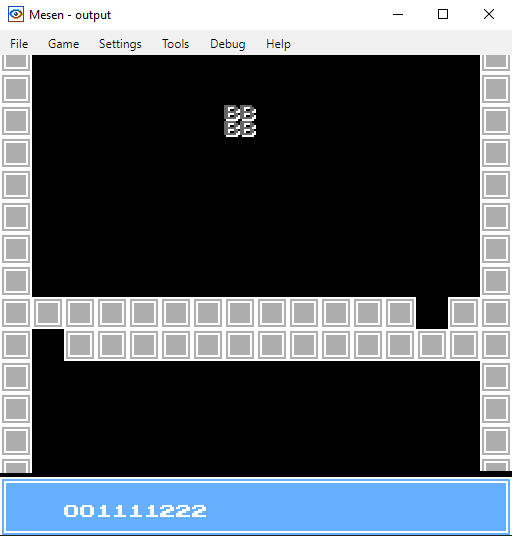

# MMC3 Vertical scroll/status bar starter

This is a bare bones NES starter project intended as a jumping off point for NES 6502 assembly development using the CA65 assembler.

Includes minimalist MMC3 setup, vertical metatile scrolling and status bar.

Rom loads to a 'title screen'. Press start to change to 'level 1'

# A note on AI contributions:

This project is intentionally written and maintained by humans. Please don't use AI coding agents or code-generation tools to modify the project. This isn't an anti-AI statement, it's simply a choice I'm making for this project. Thanks for respecting it.



# Code conventions

**File names:** lower case with underscores eg. my_code.asm.  
**Zero page variables:** prefix and description with underscores eg. zp_player_x  
**Ram variables:** Omit the prefix eg. player_lives  
**Label names:** lower case with underscore (verbs for routines, nouns for data) eg. load_palette, palette_data  
**Tables:** lower case with underscore, end with _table eg. sin_table  
**Constants:** all caps with underscores eg. PLAYER_SPEED  
**Macros:** all caps with underscores eg. LOAD_POINTER  
**Local labels:** eg. @loop:  
**Hardware Registers:** always name them after NES docs: rg. PPUCTRL, PPUMASK, PPUSTATUS, OAMDATA, PPUADDR, PPUDATA  
**Structured pairs:** eg. zp_sprite_lo, zp_sprite_hi  
**Procedures:** use verbs, lower case, underscores eg. update_player  
**Instructions:** lower case eg. lda, clc  
**Pointers:** use assembly time aliases eg.  
  -  ptr:    .res 2  
  -  ptr_lo = ptr  
  -  ptr_hi = ptr+1  

## Order of segments

General order in source files:

1. .segment "HEADER"
2. .segment "ZEROPAGE"
3. .segment "BSS"
4. .segment "RODATA"
5. .segment "CODE"
6. .segment "VECTORS"
7. .segment "CHR"

Do not include empty segments.

# Makefile / how to assemble

```
begin_build:
echo " DEBUG build start ->"
ca65 src/main.asm -g -o main.o
ld65 -o output.nes -C ld65.cfg main.o --dbgfile output.dbg
ld65 -C ld65.cfg -o output.nes main.o --mapfile output.map
echo "------- DEBUG build S-U-C-C-E-S-S.-------"
```

# Comments

```
; --------------------------------------------------
; Comment here.
; --------------------------------------------------
```

# Sub routine descriptions template

```
; --------------------------------------------------
;
;
; Inputs:
; 
; Clobbers: 
;
; Outputs:
;
; Notes:
;
; --------------------------------------------------
```